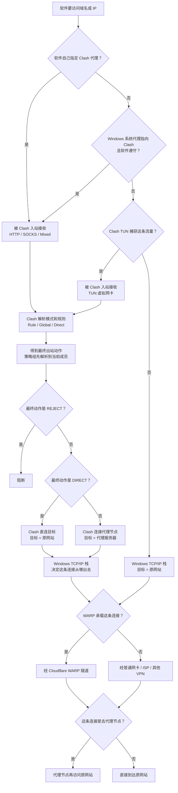
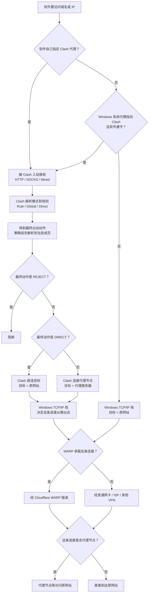

# 网络流量路径说明

Clash/Mihomo、TUN、Windows 系统代理、Cloudflare WARP 不在同一层。读图时按四层理解：

- 入口层：流量是否被 Clash 接收。
- Clash 策略层：Clash 收到流量后，按 `rule` / `global` / `direct` 决定动作。
- Clash 出站层：Clash 最后是直连原网站，还是连接代理节点。
- Windows 承载层：真正发出的连接再由 Windows 路由表、WARP、物理网卡决定出口。

## 通用正确图

适用于 Windows 上同时可能有 Clash/Mihomo 和 Cloudflare WARP 的情况。

## 本机裁剪图

按当前项目和当前观察状态，能确定删掉的是 `Clash TUN 捕获` 这一支：

- 本项目默认写入 `mixed-port`，依赖手动代理或 Windows 系统代理入口。
- 本项目不主动生成 `tun:` 配置。
- 当前后台 Mihomo 报告 `tun.enable = false`。

其他分支仍保留：手动代理、Windows 系统代理、`REJECT`、`DIRECT`、代理节点、WARP 命中/不命中都仍可能发生。

## 读图要点

- `TUN` 是入口方式，不是 `rule` / `global` / `direct` 的同类概念。
- `DIRECT` 不是裸连，只是不走代理节点；后续仍会经过 Windows 路由，可能继续被 WARP 承载。
- `GLOBAL` 不等于一定走代理，它取决于 Global 选择器当前选中的成员。
- WARP 属于 Windows 路由/虚拟网卡承载层，可承载普通软件流量，也可承载 Clash 的直连或代理节点连接。
- DNS 可能单独走应用 DNS、Windows DNS、Clash DNS、fake-ip、WARP DNS/Gateway；上图主要描述数据连接。
